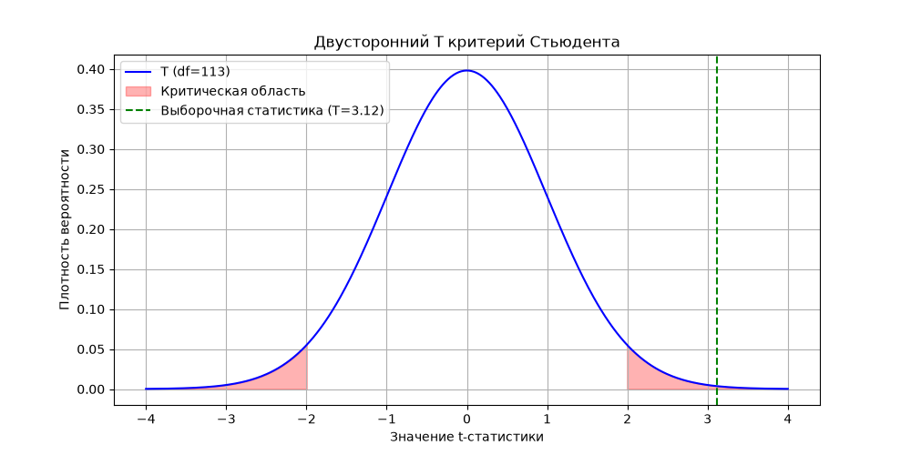

# Одновыборочный критерий Стьюдента
Автор: Карасёва Яна

## Цель исследования
Проверить гипотезу о том, что **средний уровень глюкозы у диабетиков равен 130**.

## Формулировка гипотез
* H0: μ = 130
* H1: μ ≠ 130
* Уровень значимости: α = 0.05

## Анализ данных
* Объём выборки: 114
* Минимум: 78
* Максимум: 197
* Среднее арифметическое: 138.66
* Дисперсия: 872.83
* Стандартное отклонение: 29.54
* Медиана: 136.5
* Мода: 109
* Уникальных значений: 76

## Результаты t‑теста
* t‑статистика: 3.1152
* Критическое значение: 1.9812
* p‑значение: 0.00233

## График
Ниже представлен график t‑распределения с выделенной критической областью и отмеченным значением выборочной статистики.

## Вывод
Так как:
* |t| > критического значения
* p‑value < α

**то гипотеза H0 отвергается**.
Средний уровень глюкозы у диабетиков статистически отличается от 130.

## Использованные методы
* описательная статистика;
* расчёт t‑статистики вручную;
* критические значения распределения Стьюдента;
* визуализация критической области;
* интерпретация результатов.

## Использованные библиотеки
* Pandas
* NumPy
* Matplotlib
* SciPy
* statistics