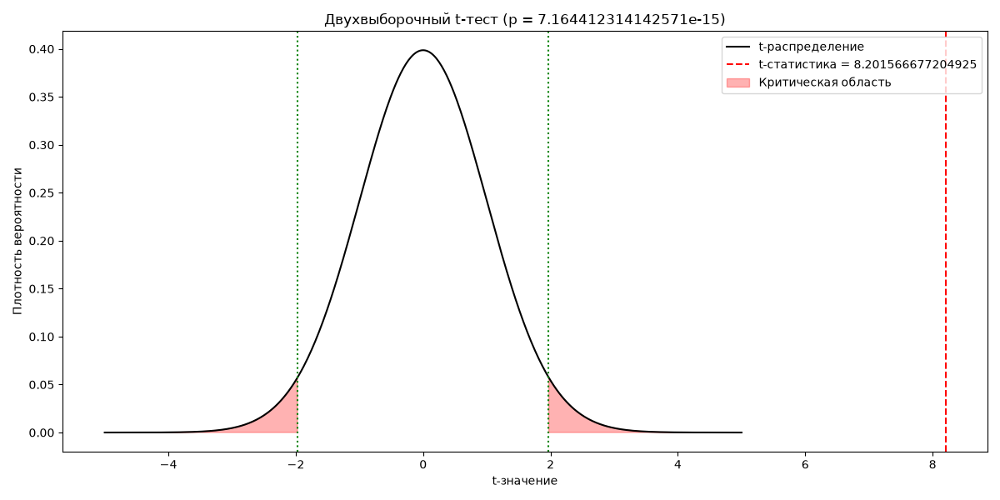

# Двухвыборочный критерий Стьюдента
Автор: Карасёва Яна

## Цель исследования
Сравнить средний уровень глюкозы у диабетиков и не диабетиков.

## Формулировка гипотез
* H0: μ₁ = μ₂ — средние уровни глюкозы одинаковы
* H1: μ₁ ≠ μ₂ — средние уровни глюкозы различаются
* Уровень значимости: α = 0.05

## Анализ данных
### Объёмы выборок
* n₁ = 114 (диабетики)
* n₂ = 186 (не диабетики)

### Основные статистики
* Минимумы: min₁ = 78, min₂ = 0
* Максимумы: max₁ = 197, max₂ = 197
* Средние: mean₁ = 138.66, mean₂ = 110.33
* Дисперсии: var₁ = 872.83, var₂ = 824.79
* Медианы: med₁ = 136.5, med₂ = 107.5
* Стандартные отклонения: st₁ = 29.54, st₂ = 28.72
* Моды: moda₁ = 109, moda₂ = 100

## Результаты двухвыборочного t‑теста
* t‑статистика: 8.2016
* p‑значение: 7.16 × 10⁻¹⁵
* Критические значения:
    * c_left = −1.968
    * c_right = 1.968

## Вывод
Так как:
* |t| значительно больше критического значения
* p‑value намного меньше уровня значимости

**то гипотеза H0 отвергается**.

Средний уровень глюкозы у диабетиков и не диабетиков статистически различается.

## График критической области
Ниже представлен график t‑распределения с выделенной критической областью и отмеченным значением выборочной статистики.

## Использованные методы
* разделение выборок по признаку диабета;
* расчёт описательных статистик;
* двухвыборочный t‑тест;
* визуализация критической области;
* интерпретация результатов.

## Использованные библиотеки
* Pandas
* NumPy
* Matplotlib
* SciPy
* statistics